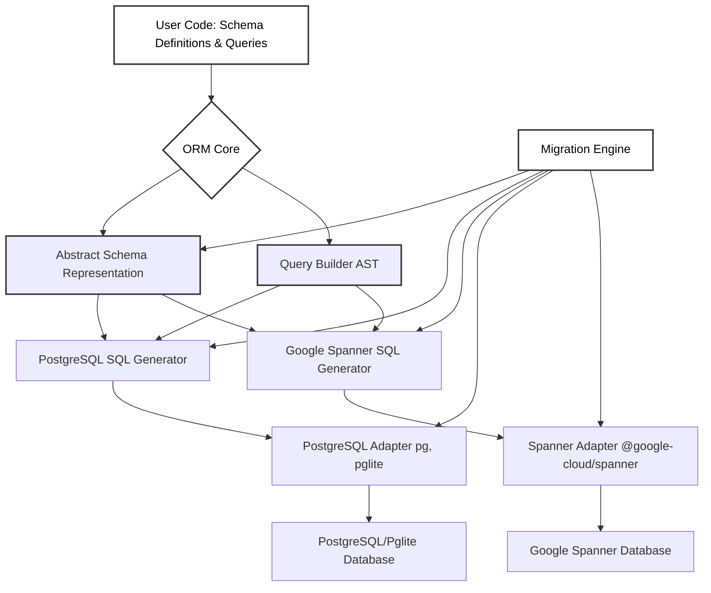

# spanner-orm

A TypeScript ORM for Google Spanner & PostgreSQL, designed for Node.js and Bun. Inspired by Drizzle ORM, `spanner-orm` aims to provide a single, elegant object model for defining your schema and querying your data across both database systems.

## Core Features

`spanner-orm` is designed to provide a seamless and powerful experience for managing data across PostgreSQL and Google Spanner. Its core capabilities include:

- **Unified Object Model:** Define your database schema once using a Drizzle-inspired syntax that supports both PostgreSQL and Google Spanner. This single object model simplifies development and ensures consistency across diverse database environments.

- **Comprehensive Migration Support:** Produces and manages migration files with the appropriate DDL for both PostgreSQL and Spanner. Migrations can be executed via the `spanner-orm-cli migrate` command (e.g., `migrate latest`, `migrate down`, `migrate create`) or programmatically within your application, ensuring your schema evolves reliably across both database systems.

- **Versatile Query Capabilities:** Build type-safe queries using an intuitive query builder for common operations, or seamlessly fall back to raw SQL (via the `sql` template literal tag) when you need fine-grained control or to leverage dialect-specific features.

- **Optimized Multi-Dialect SQL & Flexible Deployment:**

  - Generates Google SQL specifically tailored for Spanner's unique architecture and capabilities.
  - Produces standard, highly compatible SQL for PostgreSQL, suitable for a wide range of use cases.
  - This dual-dialect approach empowers you to use a single codebase with PostgreSQL for non-Spanner deployments (including enterprise setups or local development with Pglite for fast iteration and embedded scenarios) and Google Spanner for applications demanding global scale and high availability.

- **Composable Schemas:** Easily create and reuse schema components (e.g., for common fields like `id`, `createdAt`, `updatedAt`, or base entity structures), promoting DRY principles and maintainable data models, inspired by Drizzle ORM's approach.

- **TypeScript First:** Built from the ground up with TypeScript, `spanner-orm` offers a robust, type-safe, and enjoyable developer experience, with strong type inference from your schema definitions.

## Why spanner-orm?

In today's diverse application landscape, developers often face a choice between the global scale of Google Spanner and the widespread adoption and flexibility of PostgreSQL. `spanner-orm` eliminates this dichotomy by addressing a critical need: a unified ORM for the Node.js/Bun ecosystem that seamlessly supports both.

**Key Problems Solved:**

- **Eliminates Dual Data Models:** Traditionally, supporting both Spanner and PostgreSQL meant maintaining separate data access layers or complex conditional logic. `spanner-orm` provides a single, Drizzle-inspired object model, allowing you to define your schema once and use it across both database systems.
- **Streamlines Development Across Environments:** Develop locally with Pglite for speed and simplicity, deploy to traditional PostgreSQL instances for enterprise needs, and scale globally with Google Spanner, all using the same ORM and data definitions. This drastically reduces the friction of moving between development, testing, and production environments.
- **Bridges the Gap for Versatile Deployments:**
  - **Spanner for Scale:** Leverage Google Spanner's unparalleled horizontal scalability, strong consistency, and global distribution for demanding web applications.
  - **PostgreSQL for Flexibility:** Utilize PostgreSQL for a wide array of applications, including non-Spanner enterprise deployments or scenarios where a traditional relational database is preferred.
  - **Pglite for Local & Embedded Use:** Employ Pglite for rapid local development, testing, or even for bundling your application with an embedded database for client-side or local-first applications.
- **Consistent Migration Strategy:** Generate and manage database migrations for both Spanner (Google SQL) and PostgreSQL from a single source of truth, ensuring your schema evolves consistently across all target platforms.
- **Productive, Type-Safe Development:** Offers a familiar Drizzle-like API with the full benefits of TypeScript, including strong type inference from your schema, leading to fewer runtime errors and a more enjoyable developer experience.

`spanner-orm` empowers you to build applications that are both scalable and adaptable, without the overhead of managing disparate ORMs or data access strategies.

## Architecture Overview



## Project Roadmap & TODOs

This project will be developed in phases. Here's a high-level overview:

### Phase 1: Core Schema Definition & Basic DDL

- [x] **T1.1: Core Schema Primitives:**
  - Implement `table()`, `text()`, `varchar()`, `integer()`, `boolean()`, `timestamp()`, `jsonb()` (and Spanner equivalents like `JSON` or `STRING`/`BYTES`).
  - Support for `notNull()`, `default()`, `primaryKey()`.
  - Basic `index()` and `uniqueIndex()`.
  - Enable schema composition (e.g., `baseModel`, `timestamps` patterns).
- [x] **T1.2: TypeScript Typing for Schema:**
  - Strong typing for schema definitions.
  - Infer TypeScript model types from schema.
- [x] **T1.3: PostgreSQL DDL Generator (Initial):**
  - Generate `CREATE TABLE` SQL for PostgreSQL from schema definitions.
- [x] **T1.4: Spanner DDL Generator (Initial):**
  - Generate `CREATE TABLE` SQL for Google Spanner, handling type and constraint differences.
- [x] **T1.5: Basic CLI for DDL Output:**
  - Command to output generated DDL for a specified dialect.

### Phase 2: Query Building & Execution (Read Operations) - COMPLETED

- [x] **T2.1: Basic Query Builder API:**
  - Implemented `select().from().where()` structure.
- [x] **T2.2: PostgreSQL DML Generator (SELECT):**
  - Translated query builder AST to PostgreSQL `SELECT` statements.
- [x] **T2.3: Spanner DML Generator (SELECT):**
  - Translated query builder AST to Spanner `SELECT` statements.
- [x] **T2.4: Database Adapters (Initial):**
  - Implemented PostgreSQL adapter (for `pg`/`postgres.js`).
  - Implemented Spanner adapter (for `@google-cloud/spanner`).
  - Implemented Pglite adapter.
- [x] **T2.5: `sql` Tag Function for Raw Queries.**
  - Implemented `sql` tag function for raw query execution.

### Phase 3: Advanced Schema Features & DML (Write Operations) - COMPLETED

- [x] **T3.1: Advanced Column Types & Constraints:**
  - Implemented foreign keys (`references()`, `onDelete`).
  - Implemented multiple primary keys (via `table` extra options).
  - Implemented Spanner-specific feature: `INTERLEAVE IN PARENT` (via `table` extra options).
  - Implemented enhanced default value functions (`.$defaultFn()`).
- [x] **T3.2: Query Builder Enhancements (Writes):**
  - Implemented `insert()`, `update()`, `deleteFrom()` methods in QueryBuilder.
- [x] **T3.3: DML Generators (INSERT, UPDATE, DELETE):**
  - Extended SQL generators in QueryBuilder for write operations (PostgreSQL & Spanner).
- [x] **T3.4: Transaction Support API.**
  - Implemented `transaction(callback)` method in PostgreSQL, Spanner, and Pglite adapters.

### Phase 4: Migration Engine

- [ ] **T4.1: Schema Snapshotting/Introspection.**
- [ ] **T4.2: Schema Diffing Logic.**
- [ ] **T4.3: Migration File Generation (DDL for both dialects).**
  - This engine will be responsible for generating the full set of DDL statements to align the database schema with the defined models.
  - For Spanner, this will include generating `CREATE UNIQUE INDEX` statements for any columns or sets of columns marked with `unique()` or `uniqueIndex()` in the schema definition.
  - Similarly, for PostgreSQL, if we decide to use `CREATE UNIQUE INDEX` for all unique constraints (for consistency or for features not available in inline constraints), the migration engine would handle that. It would also handle non-unique indexes (`CREATE INDEX`) for both dialects.
  - This also applies to other DDL like `ALTER TABLE` for adding/removing columns, constraints, etc.
  - Note that spanner has a limit of 10 on DDL statements that require validation or backfill. You can batch more without validation, but to be safe, we should just make our migration files be limited to 10 ddl statements at a time when adding indices, etc.
- [ ] **T4.4: Migration CLI (`migrate latest`, `migrate down`, `migrate create`) - IN PROGRESS.**
  - Development of the command-line interface for managing migrations. This includes commands for applying the latest migrations, rolling back migrations, and creating new blank migration files.
- [ ] **T4.5: Migration Tracking Table.**
  - Implementation of a dedicated table (e.g., `spanner_orm_migrations`) in the user's database to keep track of applied migrations for both dialects.

### Phase 5: Advanced Features & Polish

- [ ] **T5.1: Advanced Querying:** Joins, aggregations, grouping, ordering, pagination.
- [ ] **T5.2: Relational Mappings in Schema & Query Builder.**
- [ ] **T5.3: Performance Optimizations (e.g., batching for Spanner).**
- [ ] **T5.4: Comprehensive Documentation & Examples.**
- [ ] **T5.5: Robust Testing Suite (unit & integration tests).**

### Beyond Phase 5: Future Considerations

- **Advanced Dialect-Specific Features:**
  - Support for Google Spanner Graph Queries.
  - Exploration of PostgreSQL extensions for feature parity (e.g., Apache AGE for graph capabilities).
- **Further Performance Enhancements.**
- **Community-Driven Features.**

## Getting Started

1.  **Installation:**

    ```bash
    # (Once published to npm)
    # npm install spanner-orm
    # bun install spanner-orm
    # yarn add spanner-orm

    # For now, clone and build locally:
    git clone https://github.com/your-repo/spanner-orm.git # Replace with actual repo
    cd spanner-orm
    bun install
    bun run build
    ```

2.  **Define your schema (Drizzle-Inspired):** Create a `schema.ts` (or similar) file. `spanner-orm` allows you to define your data model in a way that's familiar to Drizzle ORM users, emphasizing composability and type safety.

    ```typescript
    // src/schema.ts
    import {
      table, // Replaces pgTable from Drizzle
      text,
      timestamp,
      varchar,
      integer,
      // boolean, // Assuming boolean is available or will be
      // uniqueIndex, // Assuming uniqueIndex is available or will be
      // primaryKey, // Often part of column definition, e.g., .primaryKey()
      // jsonb, // Assuming jsonb or equivalent (e.g., json for PG, JSON/STRING for Spanner)
      // index, // Assuming index is available or will be
      sql, // For raw SQL expressions like default values
    } from "spanner-orm"; // Adjust import path as per your project structure
    import crypto from "crypto"; // For generating UUIDs

    // --- Define a placeholder 'users' table for demonstrating references ---
    // This would typically be in your main schema file or imported.
    export const users = table("users", {
      id: varchar("id", { length: 36 }).primaryKey(), // Assuming user ID is a string UUID
      // ... other user fields
    });

    // --- Shared Schema Components (Example: place in 'src/lib/sharedSchemas.ts') ---

    // Common timestamp fields
    export const timestamps = {
      createdAt: timestamp("created_at", { withTimezone: true })
        .default(sql`CURRENT_TIMESTAMP`) // Use backticks for sql template literal
        .notNull(),
      updatedAt: timestamp("updated_at", { withTimezone: true })
        .default(sql`CURRENT_TIMESTAMP`) // Use backticks for sql template literal
        .notNull(),
      // Drizzle's .$onUpdate(() => new Date()) would require adapter-specific handling or triggers
    };

    // Base model with ID and timestamps
    export const baseModel = {
      id: varchar("id", { length: 36 })
        // .$defaultFn(() => crypto.randomUUID()) // .$defaultFn is Drizzle-specific;
        // For spanner-orm, default generation might be handled differently
        // or you might set it at application level before insert.
        // For this example, we'll assume a client-generated UUID or a DB default if supported.
        .primaryKey(), // crypto.randomUUID() can be used by application logic to generate default.
      ...timestamps,
    };

    // For resources that are owned by a user
    export const ownableResource = {
      // Removed 'any' type for better practice if possible
      ...baseModel,
      userId: varchar("user_id", { length: 36 }) // Assuming user_id is also a UUID
        .notNull()
        .references(() => users.id, { onDelete: "cascade" }), // Ensure references() is implemented
    };

    // For resources that have visibility permissions
    // type VisibilityStatus = "private" | "shared" | "public"; // Example type for visibility

    export const permissibleResource = {
      // Removed 'any' type
      ...ownableResource,
      visibility: varchar("visibility", { length: 10 }) // e.g., 'private', 'shared', 'public'
        .default("private")
        .notNull(),
      // .$type<VisibilityStatus>() // .$type is a Drizzle-specific helper for type assertion.
      // In spanner-orm, this would be managed by TypeScript's inference.
    };

    // --- Example Table: Uploads (using shared components) ---
    export const uploads = table("uploads", {
      // Use `table` from spanner-orm
      ...permissibleResource, // Includes id, createdAt, updatedAt, userId, visibility
      gcsObjectName: text("gcs_object_name").notNull(), // Full path in GCS
      fileName: text("file_name").notNull(),
      fileType: text("file_type").notNull(), // General type: 'image', 'audio', etc.
      mimeType: text("mime_type").notNull(), // Specific MIME type: 'image/jpeg'
      size: integer("size").notNull(), // File size in bytes
    });

    // You can then use these definitions to generate DDL or build queries.
    ```

    This example demonstrates how you can compose schemas from shared building blocks, similar to patterns used in Drizzle ORM.
    _(Note: Features like `.references()`, `.$defaultFn()`, advanced indexing, and specific type mappings like `jsonb` are part of ongoing development as outlined in the roadmap. The import paths and exact feature set of `spanner-orm` should be adjusted based on the library's actual implementation.)_

## Usage Examples

### Generating DDL with the CLI

Once you have defined your schema (e.g., in `src/schema.ts`), you can generate DDL for PostgreSQL or Spanner:

```bash
# Ensure the project is built (bun run build)
# The CLI will be available via the 'bin' script in package.json

# Generate PostgreSQL DDL
npx spanner-orm-cli --schema ./path/to/your/schema.ts --dialect pg

# Example with a schema file in dist (after build)
npx spanner-orm-cli --schema ./dist/schema.js --dialect pg

# Generate Spanner DDL
npx spanner-orm-cli --schema ./dist/schema.js --dialect spanner
```

This will print the generated `CREATE TABLE` statements to standard output.

### Managing Database Migrations with the CLI

Once your schema is defined and the migration engine is further developed (specifically T4.4 onwards), you'll be able to manage database schema changes using the CLI:

```bash
# Ensure the project is built (bun run build)
# The CLI will be available via the 'bin' script in package.json (e.g., spanner-orm-cli)

# Create a new blank migration file (e.g., for custom DDL or data seeding)
# This will generate a timestamped file in your migrations directory.
npx spanner-orm-cli migrate create --name my_new_feature

# Generate migration files based on schema changes (from T4.3)
# (This command might look like this once T4.1-T4.3 are complete)
# npx spanner-orm-cli migrate generate --schema ./dist/schema.js

# Apply all pending migrations to the database
# This will execute migrations for the dialect specified in your ORM config or via a flag.
npx spanner-orm-cli migrate latest --config ./path/to/ormconfig.js

# Roll back the last applied migration
npx spanner-orm-cli migrate down --config ./path/to/ormconfig.js

# List status of all migrations
npx spanner-orm-cli migrate status --config ./path/to/ormconfig.js
```

_(Note: The exact commands and options for `migrate generate`, `latest`, `down`, and `status` will be finalized as part of T4.4 development. The `--config` flag is an example of how database connection details and dialect might be provided to the migration tool.)_

---

_This project is under active development._
