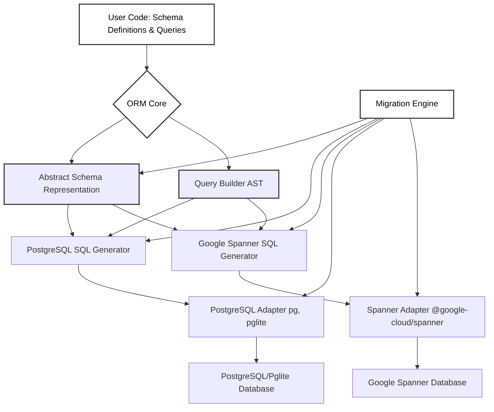

# spanner-orm

A TypeScript ORM for Google Spanner & PostgreSQL, designed for Node.js and Bun. Inspired by Drizzle ORM, `spanner-orm` aims to provide a single, elegant object model for defining your schema and querying your data across both database systems.

## Core Features

- **Unified Object Model:** Define your database schema once using a Drizzle-like syntax and use it for both PostgreSQL and Google Spanner.
- **Dual Dialect SQL Generation:**
  - Generates Google SQL specifically tailored for Spanner.
  - Generates standard, highly compatible SQL for PostgreSQL (and Pglite for local/embedded use).
- **Comprehensive Migration Support:**
  - Produces migration files with DDL for both PostgreSQL and Spanner.
  - Enables migration execution via a CLI tool or programmatically.
- **Flexible Querying:**
  - Construct type-safe queries with an intuitive query builder.
  - Seamlessly fall back to raw SQL for complex or dialect-specific operations.
- **Composable Schemas:** Easily create and reuse schema components (e.g., for common fields like timestamps, base entity structures).
- **TypeScript First:** Built from the ground up with TypeScript for a robust, type-safe, and enjoyable developer experience.

## Why spanner-orm?

`spanner-orm` addresses a critical need for developers building applications that require the immense scalability of Google Spanner while also desiring the versatility of PostgreSQL for other deployment scenarios (e.g., non-Spanner enterprise deployments, local development with Pglite, or applications where data resides locally). Currently, the Node.js/Bun ecosystem lacks a dedicated ORM that elegantly bridges these two powerful database systems with a single, consistent object model. `spanner-orm` fills this gap by:

- Allowing a single codebase for data modeling across different database backends.
- Simplifying the transition between local/testing environments (using Pglite/Postgres) and production environments (using Spanner or Postgres).
- Providing a productive and familiar Drizzle-inspired API.

## Architecture Overview



## Project Roadmap & TODOs

This project will be developed in phases. Here's a high-level overview:

### Phase 1: Core Schema Definition & Basic DDL

- [x] **T1.1: Core Schema Primitives:**
  - Implement `table()`, `text()`, `varchar()`, `integer()`, `boolean()`, `timestamp()`, `jsonb()` (and Spanner equivalents like `JSON` or `STRING`/`BYTES`).
  - Support for `notNull()`, `default()`, `primaryKey()`.
  - Basic `index()` and `uniqueIndex()`.
  - Enable schema composition (e.g., `baseModel`, `timestamps` patterns).
- [x] **T1.2: TypeScript Typing for Schema:**
  - Strong typing for schema definitions.
  - Infer TypeScript model types from schema.
- [x] **T1.3: PostgreSQL DDL Generator (Initial):**
  - Generate `CREATE TABLE` SQL for PostgreSQL from schema definitions.
- [x] **T1.4: Spanner DDL Generator (Initial):**
  - Generate `CREATE TABLE` SQL for Google Spanner, handling type and constraint differences.
- [x] **T1.5: Basic CLI for DDL Output:**
  - Command to output generated DDL for a specified dialect.

### Phase 2: Query Building & Execution (Read Operations)

- [ ] **T2.1: Basic Query Builder API:**
  - Implement `select().from().where()` structure.
- [ ] **T2.2: PostgreSQL DML Generator (SELECT):**
  - Translate query builder AST to PostgreSQL `SELECT` statements.
- [ ] **T2.3: Spanner DML Generator (SELECT):**
  - Translate query builder AST to Spanner `SELECT` statements.
- [ ] **T2.4: Database Adapters (Initial):**
  - PostgreSQL adapter (for `pg`/`postgres.js`).
  - Spanner adapter (for `@google-cloud/spanner`).
  - Pglite adapter.
- [ ] **T2.5: `sql` Tag Function for Raw Queries.**

### Phase 3: Advanced Schema Features & DML (Write Operations)

- [ ] **T3.1: Advanced Column Types & Constraints:**
  - Foreign keys (`references()`, `onDelete`).
  - Multiple primary keys. Ex: `PRIMARY_KEY(user_id, post_id)`
  - Spanner-specific features (e.g., `INTERLEAVE IN PARENT`).
  - Enhanced default value functions (`.$defaultFn()`).
- [ ] **T3.2: Query Builder Enhancements (Writes):**
  - Implement `insert()`, `update()`, `deleteFrom()`.
- [ ] **T3.3: DML Generators (INSERT, UPDATE, DELETE):**
  - Extend SQL generators for write operations.
- [ ] **T3.4: Transaction Support API.**

### Phase 4: Migration Engine

- [ ] **T4.1: Schema Snapshotting/Introspection.**
- [ ] **T4.2: Schema Diffing Logic.**
- [ ] **T4.3: Migration File Generation (DDL for both dialects).**

  - This engine will be responsible for generating the full set of DDL statements to align the database schema with the defined models.
  - For Spanner, this will include generating `CREATE UNIQUE INDEX` statements for any columns or sets of columns marked with `unique()` or `uniqueIndex()` in the schema definition.

  - Similarly, for PostgreSQL, if we decide to use `CREATE UNIQUE INDEX` for all unique constraints (for consistency or for features not available in inline constraints), the migration engine would handle that. It would also handle non-unique indexes (`CREATE INDEX`) for both dialects.

  - This also applies to other DDL like `ALTER TABLE` for adding/removing columns, constraints, etc.

- [ ] **T4.4: Migration CLI (`migrate latest`, `migrate down`, `migrate create`).**
- [ ] **T4.5: Migration Tracking Table.**

### Phase 5: Advanced Features & Polish

- [ ] **T5.1: Advanced Querying:** Joins, aggregations, grouping, ordering, pagination.
- [ ] **T5.2: Relational Mappings in Schema & Query Builder.**
- [ ] **T5.3: Performance Optimizations (e.g., batching for Spanner).**
- [ ] **T5.4: Comprehensive Documentation & Examples.**
- [ ] **T5.5: Robust Testing Suite (unit & integration tests).**

### Beyond Phase 5: Future Considerations

- **Advanced Dialect-Specific Features:**
  - Support for Google Spanner Graph Queries.
  - Exploration of PostgreSQL extensions for feature parity (e.g., Apache AGE for graph capabilities).
- **Further Performance Enhancements.**
- **Community-Driven Features.**

## Getting Started

1.  **Installation:**

    ```bash
    # (Once published to npm)
    # npm install spanner-orm
    # bun install spanner-orm
    # yarn add spanner-orm

    # For now, clone and build locally:
    git clone https://github.com/your-repo/spanner-orm.git # Replace with actual repo
    cd spanner-orm
    bun install
    bun run build
    ```

2.  **Define your schema:** Create a `schema.ts` (or similar) file:

    ```typescript
    // src/schema.ts
    import { table, text, integer, pg } from "spanner-orm"; // Adjust import path

    export const users = table("users", {
      id: integer("id").primaryKey(),
      name: text("name").notNull(),
      email: text("email").unique(),
    });

    export const posts = table("posts", {
      id: integer("id").primaryKey(),
      title: text("title").notNull(),
      userId: integer("user_id").references(() => users.id), // Example, references not fully implemented yet
    });
    ```

    _(Note: `references()` and full foreign key support is part of a later phase)_

## Usage Examples

### Generating DDL with the CLI

Once you have defined your schema (e.g., in `src/schema.ts`), you can generate DDL for PostgreSQL or Spanner:

```bash
# Ensure the project is built (bun run build)
# The CLI will be available via the 'bin' script in package.json

# Generate PostgreSQL DDL
npx spanner-orm-cli --schema ./path/to/your/schema.ts --dialect pg

# Example with a schema file in dist (after build)
npx spanner-orm-cli --schema ./dist/schema.js --dialect pg

# Generate Spanner DDL
npx spanner-orm-cli --schema ./dist/schema.js --dialect spanner
```

This will print the generated `CREATE TABLE` statements to standard output.

---

_This project is under active development._
