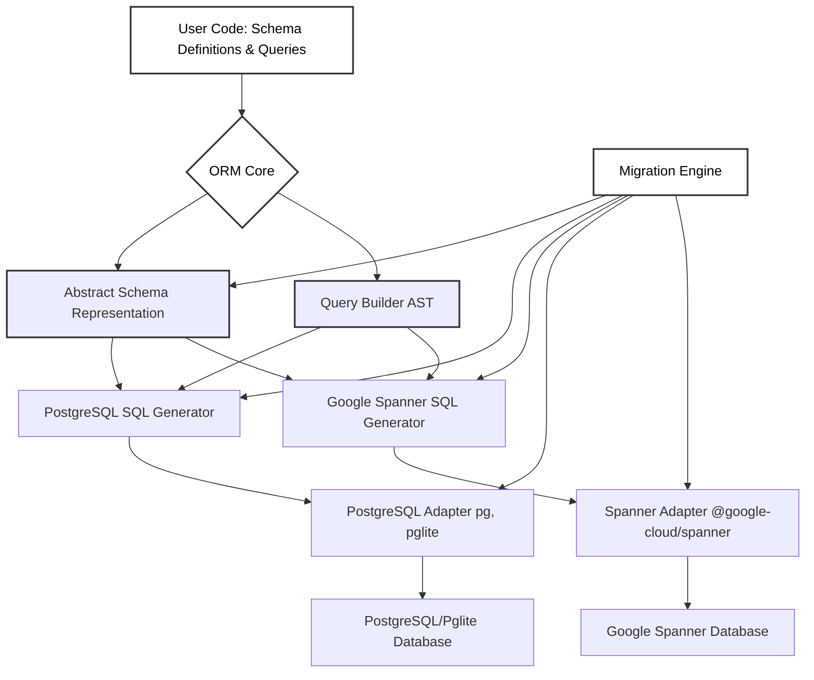

**A TypeScript ORM for Google Spanner & PostgreSQL, designed for Node.js and Bun.**

Inspired by Drizzle ORM, `spanner-orm` aims to provide a single, elegant object model for defining your schema and querying your data across both database systems.

Find it on NPM at https://www.npmjs.com/package/spanner-orm or on github at https://github.com/Flux159/spanner-orm/

## Quickstart

Read the [getting started doc](https://flux159.github.io/spanner-orm/docs/getting-started/).

## Key Requirements & Design Goals

`spanner-orm` is built to address the following key requirements for developers working with PostgreSQL and Google Spanner:

- **Single Object Model for PostgreSQL & Spanner:** Supports both PostgreSQL & Google Spanner with a single, Drizzle-inspired object model. Define your schema once and use it across both database systems.
- **Cross-Dialect Migrations:** Produces migrations for both PostgreSQL & Spanner. These migrations can be run via the `spanner-orm-cli migrate` command or programmatically.
- **Flexible Querying:** Build queries with a type-safe query builder or fall back to raw SQL using the `sql` template literal tag when needed.
- **Dialect-Aware SQL:**
  - **Spanner:** Supports Google SQL as the dialect for Spanner.
  - **PostgreSQL/PGLite:** Uses almost equivalent SQL for PostgreSQL & PGLite.
  - This allows users to leverage PostgreSQL for non-Spanner deployments, PGLite for local development or embedded applications, and Spanner for global-scale web apps, all from a unified codebase.
- **Composable Schemas (Drizzle-Inspired):** Easily create and reuse schema components (e.g., common fields like `id`, `timestamps`, or base entity structures like `ownableResource`), promoting DRY (Don't Repeat Yourself) principles and leading to more maintainable and understandable data models.

## Why spanner-orm?

In today's diverse application landscape, developers often need to target multiple database backends. You might start with Pglite for rapid prototyping or local-first applications, move to PostgreSQL for self-hosted or managed deployments, and eventually require the massive scalability and global consistency of Google Spanner. `spanner-orm` addresses the critical challenge of managing data models and queries across these different systems without rewriting your data access layer.

Currently, the Node.js/Bun ecosystem lacks a dedicated ORM that elegantly bridges PostgreSQL and Google Spanner with a single, consistent object model and a unified migration strategy. `spanner-orm` fills this gap by:

- **Enabling a Single Codebase:** Define your schema and write your queries once. `spanner-orm` handles the dialect-specific SQL generation.
- **Streamlining Development & Deployment:** Simplify the transition between local development (Pglite/Postgres), testing, and production environments (Spanner or Postgres).
- **Reducing Complexity:** Abstract away the differences between Google SQL and PostgreSQL DDL/DML where possible, while still allowing access to dialect-specific features when needed.
- **Providing a Productive API:** Offer a familiar and productive Drizzle-inspired API that TypeScript developers will appreciate.

## Architecture Overview

To dive deeper, check out the [Docs section](/docs).
